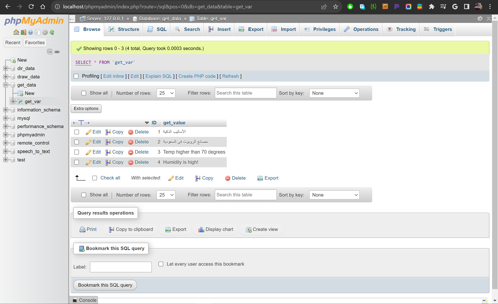

# GET-Variable

## GET.php
Contains a basic HTML form that allows users to input a value. When the form is submitted, the entered value is sent as a GET parameter to the server. The image below is the page:

## retrieve.php
Retrieves and displays all saved values from the MySQL database. As shown in the picture below:

## Database

## Note: 
All the functions in the codes have explaining comments for you to understand easily.
